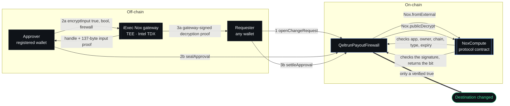
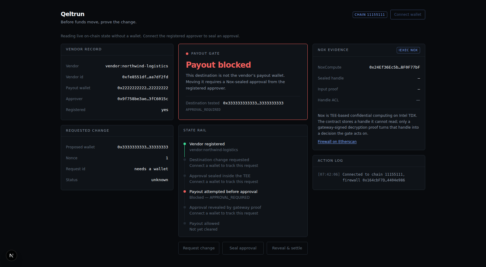
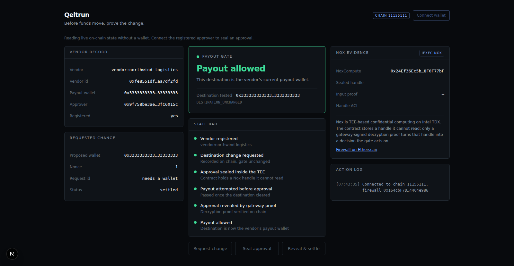

# Qeltrun

**Before funds move, prove the change.**

A fail-closed payout firewall for treasuries. A vendor's payment destination can only change if
the vendor's registered approver sealed that decision inside an [iExec Nox](https://docs.iex.ec/nox-protocol/getting-started/welcome)
TEE — bound to their wallet, bound to this contract, and revealed on chain by a gateway-signed
proof. A compromised inbox cannot produce that. Nothing else opens the gate.

```bash
pnpm install && pnpm run demo
```

---

## The problem

Vendor payment redirection is the theft that does not need a smart contract bug. Someone
compromises an email thread, sends a plausible invoice with new bank or wallet details, and
finance updates the record. Every control it passes is a human one: an email that looks right, a
signature that looks familiar, an approver who is travelling.

Treasuries moving on-chain inherit the same failure. Multisigs answer *"did enough keys sign
this transfer?"*. They do not answer *"is this address still the one this vendor is owed money
at?"* — because by the time a transfer is proposed, the destination has already been changed
somewhere upstream.

Qeltrun moves that question on chain and makes it unanswerable without proof.

## How it works

Three stages. The gate stays shut through the first two.



Read it as three gates in series, each of which the previous stage cannot satisfy on its own:

| Stage | Who | What it proves | Gate after it |
|---|---|---|---|
| `openChangeRequest` | anyone | nothing — records intent | **shut** |
| `sealApproval` | the registered approver, from the wallet that sealed | the approval bit exists inside the TEE, bound to this contract, this wallet, this chain, and not expired | **shut** — the contract holds a handle it cannot read |
| `settleApproval` | anyone holding the proof | the gateway signed the revealed bit | **open, for one address only** |

The details that make each stage hold:

**Request ids are derived on chain**, from the vendor, both wallets, the requester, a nonce,
`block.chainid` and `address(this)`. A caller cannot choose one, and one cannot be replayed to
another vendor, chain or deployment.

**`Nox.fromExternal` rejects a handle** unless *all* of these hold — the handle was minted for
**this contract** (`app == msg.sender`) and for **the calling wallet** (`owner == msg.sender`),
it carries the right chain id and TEE type, and the proof has not expired. The approver must
therefore both seal and send; a relayer cannot do it for them.

**Settlement is permissionless on purpose.** The authority is the gateway's signature, not the
caller's identity, so anyone can carry the decision on chain without being trusted. A verified
`false` settles the request as a recorded rejection.

Afterwards `isPayoutAllowed(vendorId, destination)` answers `true` for exactly one address — and
the address it moved away from now needs its own approval.

### Why Nox is load-bearing, not decorative

Strip Nox out and the contract cannot work at all. There is no other write path to the
destination: no owner, no admin key, no `setPayoutWallet`. The only state transition that moves
a vendor's wallet consumes a TEE-sealed handle and a gateway-signed decryption proof.

An attacker with **full control of every calldata argument** still cannot open the gate. They
cannot mint a handle bound to this contract and the approver's wallet, and they cannot sign a
decryption proof the gateway did not sign. That is the whole product, and it is Nox's property
rather than ours.

What that rests on: the Nox gateway's signing key, the deployed NoxCompute contract, and Intel
TDX attestation. Compromise the gateway key and the model breaks — that is inherent to building
on Nox, and [`docs/AUDIT.md`](docs/AUDIT.md) states it rather than working around it. Everything
else is untrusted, including the requester, the relayer that submits settlement, and the
TypeScript client in this repo.

## Run it

Requires Node 22+ and pnpm.

```bash
pnpm install
pnpm run demo
```

`pnpm run demo` walks the full lifecycle on an in-process Hardhat chain and **asserts every
checkpoint**, so it exits non-zero rather than printing a misleading transcript.

```
1. Stand up the Nox protocol contract locally
   NoxCompute           0x75C6AF4430cc474b1bb9b8540b7E46D6f8e1C685
   gateway              0xa0Ee7A142d267C1f36714E4a8F75612F20a79720
   chain id             31337

2. Deploy the firewall and register a vendor
   firewall             0x9fE46736679d2D9a65F0992F2272dE9f3c7fa6e0
   vendor               vendor:northwind-logistics (0xfe8551dfbb91003d…)
   payout wallet        0x1111111111111111111111111111111111111111
   approver             0x70997970C51812dc3A010C7d01b50e0d17dc79C8

3. An invoice arrives asking for a new destination — the gate holds
   gate                 BLOCKED  APPROVAL_REQUIRED

4. Open a change request — still blocked, because opening proves nothing
   request id           0xef6a75892c94fb3ec28dc0df166729ac9f2439d2ab4d96158b1547419241f71a
   status               pending
   gate                 BLOCKED  APPROVAL_REQUIRED

5. Approver seals the decision inside the TEE — still blocked, the bit is opaque
   nox handle           0x0000007a690001f8ecf1020a1d7bed7b8fb5ca9679f1ca08b712b7c479e74a63
   input proof          0x70997970C51812dc3A010C7d… (137 bytes)
   status               sealed
   gate                 BLOCKED  APPROVAL_REQUIRED

6. Reveal the bit with a gateway-signed decryption proof — the gate opens
   decrypted bit        true
   status               settled
   gate                 ALLOWED  DESTINATION_UNCHANGED

7. And the wallet it moved away from now needs its own approval
   gate                 BLOCKED  APPROVAL_REQUIRED

All checkpoints held.
```

Note checkpoints 4 and 5: an open request does not unlock the gate, and neither does a sealed
one. Nothing moves until a proof the gateway signed says it may.

## The dashboard

A control-room UI for the same flow — vendor record, gate verdict, state rail, Nox evidence and
an action log.

The same vendor on **Ethereum Sepolia**, before and after a Nox-sealed approval. These are live
reads from the deployed contract, against the real iExec gateway — neither is a mock-up.

| Blocked | Allowed |
|---|---|
|  |  |

Note the left panel in both: the request id reads *needs a wallet*, because it is derived from
the requester and none is connected. The page still shows the real gate verdict — reading never
needs a wallet.

```bash
pnpm run node                    # terminal 1: a real chain
pnpm run setup:local             # terminal 2: deploy NoxCompute + firewall, register a vendor
pnpm --filter qeltrun-web dev    # terminal 3: http://localhost:3000
```

**The UI never simulates anything.** It always talks to a real chain running the real
NoxCompute — locally by default, or Sepolia once `NEXT_PUBLIC_SEPOLIA_FIREWALL` is set. The
only thing that differs between the two is where the approval bit gets sealed: on Sepolia that
is iExec's gateway via `@iexec-nox/handle`; locally it is a route handler holding the key the
local NoxCompute was initialized with. Both emit the same proof bytes, and the contract
verifies them with the same code.

Two things about it are deliberate:

- **It reads without a wallet.** Gate verdict, vendor record and request status all render from
  the chain before anyone clicks connect, so a broken wallet extension cannot leave a reviewer
  looking at an empty page. A wallet is only needed to *write*.
- **`setup:local` prints the approver's address.** Only that wallet can seal; every other
  wallet is rejected on chain, and the UI says so rather than letting you find out by paying
  gas.

`pnpm run export:abi` regenerates `web/lib/firewall-abi.ts` from the compiled artifact, and
`pnpm run verify` runs it — so a stale ABI shows up as a dirty git tree rather than as a
runtime failure.

`web/deployment.local.json` is committed as a snapshot of a fresh Hardhat node, so the app
builds straight after a clone. `pnpm run setup:local` overwrites it with whatever your node
actually produced; expect it to show as modified, and do not commit that.

## Testing against the real protocol, not a mock

There is no supported way to run Nox on a local chain, so most projects would mock it — and a
mock you told to reject a forged proof proves nothing about whether the protocol would.

`test/solidity/NoxLocalEnv.sol` does it differently. It deploys the **genuine `NoxCompute`**
shipped in `@iexec-nox/nox-protocol-contracts` and `vm.etch`es its runtime code to
`0x75C6AF4430cc474b1bb9b8540b7E46D6f8e1C685` — the address `Nox.noxComputeContract()` resolves
to on chain 31337. Etching copies code but not storage, which sidesteps the constructor's
`_disableInitializers()` and lets the harness initialize it with a gateway key the test
controls.

Everything downstream is real: the 137-byte proof layout, the EIP-712 digests, the ECDSA
gateway recovery, the ACL, the decryption-proof check. Every revert in the attack matrix is
produced by actual protocol verification, and every forged proof is forged the way an attacker
would have to forge it.

```bash
pnpm run verify   # typecheck + unit tests + compile + Solidity tests
```

| Suite | Count | What it covers |
|---|---:|---|
| `test/solidity/QeltrunPayoutFirewall.attack.t.sol` | 19 | The attack matrix |
| `test/solidity/QeltrunPayoutFirewall.invariant.t.sol` | 11 | Invariants and fuzz, 256 runs each |
| `test/solidity/QeltrunPayoutFirewall.t.sol` | 8 | Lifecycle and gate semantics |
| `test/solidity/RequestIdParity.t.sol` | 2 | Solidity ↔ TypeScript conformance |
| `test/*.test.ts` | 26 | Domain gate, request ids, proof encoding, API validation |

The attack matrix enumerates threats we thought of. The invariant suite states properties that
must hold for *any* sequence of calls — the gate never allows a second address, the payout
wallet never moves without an approved settlement, a handle never binds to two requests — so a
case nobody imagined still fails the build.

A sample of the attack matrix — the full table is in [`docs/AUDIT.md`](docs/AUDIT.md):

| Attack | Result |
|---|---|
| Non-approver seals with a valid handle minted for themselves | `UnauthorizedApprover` |
| Approver seals a handle minted for a **different contract** | `InvalidProof("App mismatch")` |
| Approver submits a handle minted for **someone else** | `InvalidProof("Owner mismatch")` |
| Input proof signed with the attacker's key | `InvalidProof("Invalid signature")` |
| Approval sealed hours earlier, submitted late | `InvalidProof("Proof expired")` |
| One sealed approval replayed onto a **second request** | `HandleAlreadyUsed` |
| Stale approval applied after a newer settlement | `StaleRequest` |

## Security

[`docs/AUDIT.md`](docs/AUDIT.md) is the written security review: threat model, the two real
vulnerabilities found and fixed during development, the full 19-row attack matrix, static
analysis results, accepted design trade-offs, and known limitations.

Two findings worth surfacing here, because both were found by attacking our own contract rather
than by a linter:

- **Sealed approvals could be replayed onto a different request.** A Nox input proof binds a
  handle to `(owner, app, createdAt)` — it says nothing about *which* request the approval is
  for. Fixed with a one-shot handle ledger, so a handle can be spent exactly once.
- **A stale approval could override a newer settlement.** Two requests open at once, the newer
  settles first, and the older one would then have silently overwritten it. Fixed by refusing
  to settle a request whose starting wallet no longer matches reality.

`pnpm run lint:sol` (solhint) and `pnpm run audit:deps` are clean. Slither reports three
reentrancy findings, all in `sealApproval`, all the same root cause; they are analysed and
accepted in the audit note rather than suppressed — the handle only exists after the external
call returns, so no ordering can write it first.

CI runs `pnpm run audit:slither:ci`, which compares Slither's output against
`slither-baseline.json` and passes only when the findings match exactly. A new finding fails the
build; a baseline finding that stops reproducing also fails, so the accepted list cannot outlive
the code it describes.

## Feedback for iExec

[`feedback.md`](feedback.md) is a detailed developer-experience report from building this from
an empty directory: what worked, six areas of friction with suggested fixes, and the one thing
we would most like to see — a first-class local development story for Nox.

## Layout

```
contracts/
  QeltrunPayoutFirewall.sol       the firewall — the only source of truth
  local/LocalNoxCompute.sol       local-dev artifact for the real NoxCompute
src/
  domain/                         request-id derivation and gate logic, mirroring the contract
  providers/
    nox-approval-provider.ts      the real Nox path via @iexec-nox/handle
    local-gateway-approval-provider.ts
                                  local gateway that emits genuine proof bytes
  contracts/firewall.ts           typed contract surface, shared with the frontend
scripts/
  demo.ts                         end-to-end lifecycle, asserts every checkpoint
  deploy.ts                       Sepolia deployment with chain and Nox address checks
  setup-local.ts                  stands up the full stack on a local node, for the dashboard
web/
  components/dashboard.tsx        the control room
  lib/approvals.ts                Nox gateway on Sepolia, local route handler on 31337
  app/api/local-gateway/          the local stand-in for iExec's gateway
test/
  solidity/                       attack matrix, lifecycle, cross-language parity
docs/
  AUDIT.md                        security review
  NOX_API_NOTES.md                verified facts from the installed SDK
```

The TypeScript layer deliberately **mirrors** the contract rather than duplicating its
authority. `deriveRequestId` and `decidePayout` exist so a client can show a verdict before
spending gas; the contract remains the only thing that decides. Both request-id
implementations are pinned to one shared vector so they cannot silently drift.

## Live on Ethereum Sepolia

The full lifecycle has been run end to end against the real iExec Nox gateway — not the local
one. The approval bit was encrypted by iExec's TEE, the handle was minted by their gateway, and
the decryption proof that opened the gate carries their signature.

| | |
|---|---|
| Firewall | [`0x164cbF7DC39f650F7528cE2208d93fB94404e986`](https://sepolia.etherscan.io/address/0x164cbF7DC39f650F7528cE2208d93fB94404e986) |
| NoxCompute | [`0x24Ef36Ec5b626D7DCD09a98F3083c2758F0F77bF`](https://sepolia.etherscan.io/address/0x24Ef36Ec5b626D7DCD09a98F3083c2758F0F77bF) |
| Vendor | `vendor:northwind-logistics` |

One complete change, blocked → sealed → settled → allowed:

| Step | Transaction | Gate after it |
|---|---|---|
| `registerVendor` | [`0x26cde53c…`](https://sepolia.etherscan.io/tx/0x26cde53c78622066448b780b9849be9bb504a0072578eb9fa6313eacd8a660fa) | — |
| `openChangeRequest` | [`0xb0e7ac81…`](https://sepolia.etherscan.io/tx/0xb0e7ac811e0fd6add28ea4d3a6ef69b072b587dfb809eccfc40d47e4cd824637) | **blocked** — `APPROVAL_REQUIRED` |
| `sealApproval` | [`0x2df81b1a…`](https://sepolia.etherscan.io/tx/0x2df81b1a0c0765c20ca473e837f716bbcb8028952ff10defbbc0ad9148e3cd9e) | **blocked** — the bit is sealed |
| `settleApproval` | [`0x9cd32859…`](https://sepolia.etherscan.io/tx/0x9cd32859621e6e7a5fc1abf30c8981b7526e30ecabc4677990a79ffa581487a0) | **allowed** |

The screenshots above are that exact change: the destination in both is `0x3333…3333`.

Reproduce it:

```bash
export $(grep -v '^#' .env | xargs)
export FIREWALL_ADDRESS=0x164cbF7DC39f650F7528cE2208d93fB94404e986
pnpm run verify:live
```

`pnpm run demo` proves the contract logic against genuine NoxCompute bytecode but signs proofs
with a local key. `pnpm run verify:live` is the only thing that exercises iExec's actual gateway
service, and it found something nothing else could: see the note on subgraph indexing in
[`feedback.md`](feedback.md).

## Deploying

Hardhat 3 reads secrets from the process environment and does not load `.env` files.

```bash
export SEPOLIA_RPC_URL=...
export PRIVATE_KEY=...
pnpm run deploy:sepolia
```

The script refuses to deploy to a chain Nox does not support and verifies the deployment
resolves the expected NoxCompute — a mismatch would leave every `sealApproval` failing proof
validation. Pass the deployed address as `applicationContract` to `encryptInput`; Nox binds
every input proof to it.

## Scope

Built for the iExec WTF hackathon. Deliberately out of scope, rather than overlooked:

- **Approver rotation.** Real functionality a production system needs. Adding it without a
  second approval path would create exactly the hijack this contract exists to prevent.
- **Custody.** Qeltrun answers *"may this destination be paid?"*. Enforcement lives in whatever
  moves the money.
- **Real-world bank account verification.** Vendor identities here are wallet-signed. We do not
  claim to verify that anyone owns a bank account.

Nox is TEE-based confidential computing (Intel TDX). It is not FHE and it is not zero-knowledge,
and nothing here claims otherwise.

---

MIT licensed.
